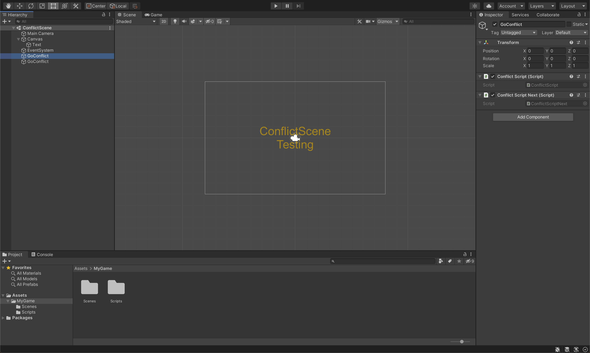

# SceneConflict-rKremser

### Project description: 
Scene Conflict Übung

### Development platform: 
MacOS, 2020.1.5f1, Visual Studio 2019, no SDKs

### Target platform: 
WebGL, ref:res 960x600, screen-independent

### Visuals: 

### Necessary setup/execution steps: 
Add Unity Project in Unity Hub. Open Unity Project.

### Third party material: 
-

### Project state: 
100%

### Limitations: 
-

### Lessons Learned: 

Copyright by rKremser
